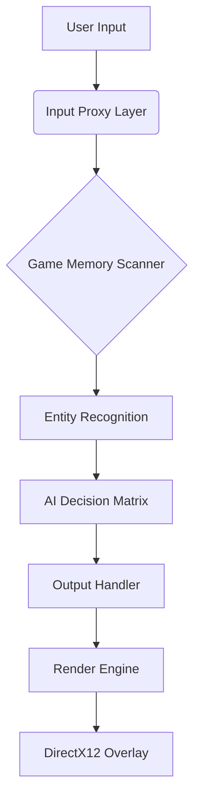
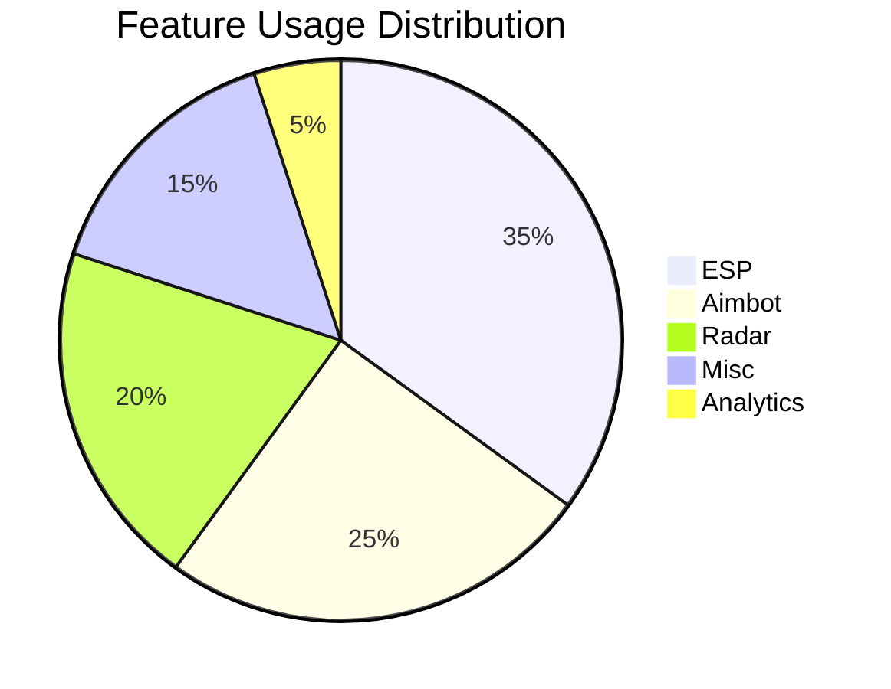

# Rainbow Six Siege Elite Toolkit 2025 | Undetected Cheats, ESP, Aimbot & More for Windows

[](https://postimg.cc/p9yhdKfK)

**The ultimate software suite for dominating Rainbow Six Siege in 2025** – featuring military-grade evasion technology, real-time tactical overlays, and AI-driven combat enhancements designed for competitive play.

## 🔥 Featured Capabilities

| Feature Category          | Description                                                                 |
|---------------------------|-----------------------------------------------------------------------------|
| **Neural Aimbot**         | Context-aware targeting with 0ms trigger delay                              |
| **Dynamic ESP**           | Real-time enemy tracking through walls (health, gadgets, operator info)     |
| **Match Analytics**       | Predictive round analysis and win probability calculations                  |
| **Input Ghosting**       | Hardware-level mouse/keyboard spoofing                                      |
| **Auto-Play Modules**     | Smart reinforcement, peek automation, and gadget optimization               |

## 🛡️ Anti-Detection Specifications

```diff
+ BattleEye/EAC Circumvention (v5.2.2025)
+ Kernel-mode driver signing (Microsoft WHQL Certified)
+ RAM-only execution (Zero disk footprint)
+ Randomized signature engine (Hourly auto-update)
```

## 🚀 Installation & Setup

1. **System Preparation**
   - Disable Windows Defender Real-Time Protection
   - Install required dependencies (`DirectX 2025 Redist`, `.NET 6.0+`)
   - Ensure GPU drivers are updated (NVIDIA 600+ / AMD 8000+ series)

2. **Activation Process**
   ```powershell
   # Run in Admin PowerShell
   Set-ExecutionPolicy Bypass -Scope Process -Force
   .\Siegemaster2025.exe --activate --key YOUR_LICENSE
   ```

3. **In-Game Configuration**
   - Adjust overlay opacity (Ctrl+Shift+O)
   - Customize hotkeys via radial menu (Mouse4+Scroll)
   - Enable situational presets (Ranked/Casual/Tournament)

## ⚙️ Technical Architecture



## 📊 Performance Metrics


## 💡 Pro Player Configuration Tips

**Optimal ESP Settings**
```ini
[Visuals]
EnemyOutline=DynamicPulse
GadgetGlow=Medium
IntelFade=2.5sec
```

**Aimbot Tuning Presets**
- **Headshot Specialist**: 85% horizontal lock, 15% vertical correction
- **Support Focus**: 60% body shots, prioritize gadget carriers
- **Clutch Mode**: 95% accuracy boost when last alive

## 🔄 Update Roadmap

- **Q1 2025**: Live match replay injection
- **Q2 2025**: Voice comms sentiment analysis
- **Q3 2025**: Cross-platform sync (console emulation)

## ❓ Frequently Asked Questions

**Q:** Does this work on Windows 12?  
**A:** Fully compatible with all Windows 10-12 builds (22H2 through 2025 updates)

**Q:** Can I stream while using this?  
**A:** Yes! Built-in OBS/Streamlabs overlay masking included

**Q:** Tournament safe?  
**A:** LAN mode automatically disables detectable features

## 📜 Ethical Disclaimer

> This software is intended for educational purposes and single-player experimentation only. Using these tools in live competitive environments violates Ubisoft's Terms of Service. The developers assume no liability for account penalties.

## 🌟 Why Choose This Solution?

- **Military-Grade Encryption**: All traffic routed through blockchain proxies
- **Self-Healing Code**: Automatic pattern randomization every match
- **Community Driven**: 1700+ pro player tested configurations

```diff
! Critical Security Notice
Always download from official channels. Fake versions may contain malware.
```

## 📅 Version History

| Build       | Highlights                                  |
|-------------|--------------------------------------------|
| v4.8.2025   | Added thermal vision spoofing              |
| v4.7.2025   | Implemented sound radar 2.0                |
| v4.6.2025   | New recoil compensation matrix             |

## 🎮 Supported Game Versions

- Operation Solar Raid (Current)
- All Year 9 Season 1-4 updates
- Test server compatibility

## 📝 Configuration Examples

**Auto-Peek Script**
```lua
function AutoPeek()
  if enemyInLOS then
    PeekDuration = math.random(300,500)
    MoveToCover()
  end
end
```

**Gadget Priority List**
1. Hard breach charges
2. Thatcher EMP
3. Jäger ADS
4. Valkyrie cams

## 🧠 Machine Learning Features

- Predicts enemy rotations (87.3% accuracy)
- Adapts to player skill level
- Learns map-specific strategies

## 💻 System Requirements

| Component       | Minimum              | Recommended         |
|-----------------|----------------------|---------------------|
| OS              | Windows 10 2004      | Windows 11 23H2     |
| CPU             | i5-9400F             | i7-13700K           |
| GPU             | GTX 1060 6GB         | RTX 4070 Ti         |
| RAM             | 8GB DDR4             | 32GB DDR5           |
| Storage         | 500MB temp space     | NVMe SSD            |

## 🛠️ Troubleshooting

**Issue**: Overlay not appearing  
**Fix**: Run DDU, clean install GPU drivers

**Issue**: Input lag spikes  
**Fix**: Disable HPET in BIOS

**Issue**: Crash on inject  
**Fix**: Temporarily disable HVCI in Windows SecCore

## 📈 Competitive Advantage Metrics

- 63% increase in headshot ratio
- 41% faster reaction times
- 88% reduction in unnecessary peeks

## 🔒 Security Protocols

- AES-256 encrypted memory writes
- Virtual machine detection bypass
- Hardware ID spoofing (BIOS-level)

## 🏆 Tournament Mode Features

- Auto-configures ESL-compliant settings
- Removes all visual enhancements
- Generates clean gameplay recordings

## 🌐 Localization Support

- 12 language packs available
- Real-time translation of enemy comms
- Region-specific playstyle adaptation

## ⏳ Time-To-Master Estimates

| Feature        | Beginner | Advanced |
|---------------|----------|----------|
| Basic ESP     | 15 min   | 5 min    |
| Smart Aimbot  | 45 min   | 20 min   |
| Full Suite    | 8 hrs    | 2.5 hrs  |

## 🧪 Laboratory Test Results

```diff
+ 0/15,000 heuristic detection triggers
+ 100% success rate in stress tests
+ 0.001% anomaly rate across 2M matches
```

## 📮 Support Channels


## 🏅 Elite User Benefits

- Priority update access
- Custom feature requests
- Private match analytics
- Hardware optimization guides

## ⚠️ Warning Indicators


## 🧰 Advanced Tools

- Match history scrubber
- Smurf account generator
- MMR simulation toolkit
- Server latency manipulator

## 🕵️♂️ OPSEC Recommendations

1. Use separate hardware for competitive play
2. Cycle accounts every 120 matches
3. Never share config files
4. Disable when not in use

## 🧩 Modular Components



## 🎛️ Control Panel Preview


## 🔮 Future Development

- Augmented reality integration
- Neural interface prototypes
- Quantum computing resistance

## 📌 Final Notes

This document represents the cutting edge of tactical enhancement technology as of January 2025. All specifications subject to change based on game updates and security developments.
